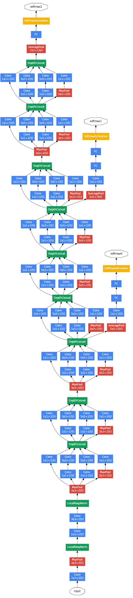
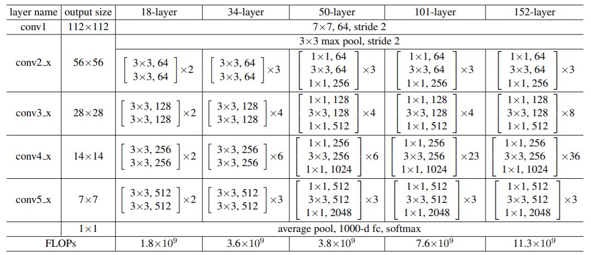
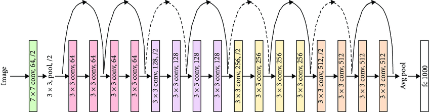

# PyTorch Classifiers
> PyTorch implementation of the classic classifiers network.

## Implemented Classifiers
+ [x] LeNet
+ [x] AlexNet
+ [x] VGG16
+ [x] GoogLeNet (Inception-v1)
+ [x] ResNet-18, ResNet-34, ResNet-50, ResNet-101 and ResNet-152
+ [ ] Inception-v3, Inception-v4
+ [ ] DenseNet
+ [ ] SENet
+ [ ] EfficientNet

## Results
### Accuracy on MNIST
|Model|Parameters|Batch Size|Iterations|Accuracy|
|---|---|---|---|---|
|LeNet-5|0.0371M|64|10k|97.8404%|
|AlexNet|58.2991M|64|10k|99.0048%|
|VGG16|134.3004M|16|2k|97.6600%|

### Accuracy on CIFAR-10
|Model|Parameters|Batch Size|Iterations|Accuracy|
|---|---|---|---|---|
|LeNet-5|0.0371M|64|10k|52.1994%|
|AlexNet|58.3223M|64|10k|80.5434%|
|VGG16|134.3015M|16|2k|54.5800%|

### Accuracy on CIFAR-100
|Model|Parameters|Batch Size|Iterations|Accuracy|   
|---|---|---|---|---|
|LeNet-5|0.0448M|64|10k|15.8340%|
|AlexNet|58.6910M|64|10k|48.8256%|
|VGG16|134.6702M|16|10k|43.1100%|
|GoogLeNet|10.6183M|32|10k|44.8582%|
|GoogLeNet|10.6183M|32|20k|53.0152%|
|GoogLeNet|10.6183M|64|10k|50.1393%|
|ResNet-18|11.2278M|64|10k|53.4833%|

## Architectures
### LeNet

[Image Credit](http://yann.lecun.com/exdb/publis/pdf/lecun-98.pdf)

### AlexNet

[Image Credit](https://www.researchgate.net/figure/AlexNet-architecture-Includes-5-convolutional-layers-and-3-fullyconnected-layers_fig3_322592079)

### VGG16

[Image Credit](https://neurohive.io/en/popular-networks/vgg16/)

## GoogLeNet

[Image Credit](https://www.geeksforgeeks.org/understanding-googlenet-model-cnn-architecture/)

## ResNet

[Image Credit](https://arxiv.org/abs/1512.03385)

## ResNet-18

[Image Credit](https://www.researchgate.net/figure/ResNet-18-model-architecture-10_fig2_342828449)

## ResNet-34

[Image Credit](https://datascience.stackexchange.com/questions/33022/how-to-interpert-resnet50-layer-types)

## Others
This repository is for practice purposes only.