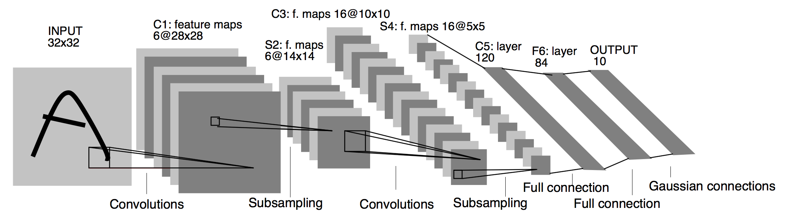

# PyTorch Classifiers
> PyTorch implementation of the classic classifiers network.

## Implemented Classifiers
+ [x] LeNet
+ [x] AlexNet
+ [ ] VGGNet
+ [ ] ResNet
+ [ ] Inception-v3
+ [ ] DenseNet
+ [ ] SENet
+ [ ] EfficientNet

## Results
### Accuracy on MNIST
|Model|Parameters|Accuracy|
|---|---|---|
|LeNet-5|0.0371M|97.8404%|
|AlexNet|58.2991M|99.0048%|

Notice: batch size is 32, trained for 10k iterations.

### Accuracy on CIFAR-10
|Model|Parameters|Accuracy|
|---|---|---|
|LeNet-5|0.0371M|52.1994%|
|AlexNet|58.3223M|80.5434%|

## Architectures
### LeNet

[Image Credit](http://yann.lecun.com/exdb/publis/pdf/lecun-98.pdf)

### AlexNet

[Image Credit](https://www.researchgate.net/figure/AlexNet-architecture-Includes-5-convolutional-layers-and-3-fullyconnected-layers_fig3_322592079)

## Others
This repository is for practice purposes only.